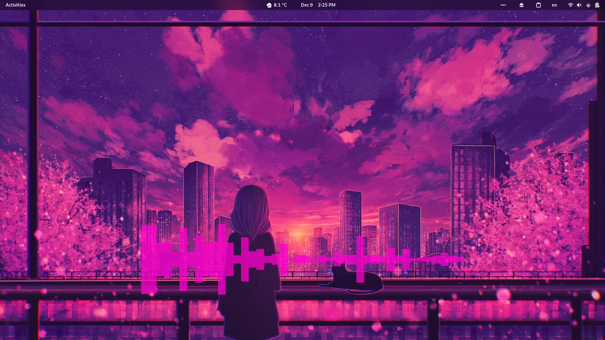

# desktop-visualizer
\*nix desktop audio visualizer made with SFML



I use some snippets of code from [cava](https://github.com/karlstav/cava) and [conky](https://github.com/brndnmtthws/conky).

# Dependencies

 - PulseAudio(for PipeWire you need pipewire-pulse)
 - fftw3
 - SFML 2.5+
 - [libinih](https://github.com/benhoyt/inih)

# Tested platforms
 - FreeBSD 13.2
 - Arch Linux
 - postmarketOS

 Probably will work on any other Unix-like OS that has Xorg and supplies the dependencies

# Building

```
$ cmake .
$ make
```

# Installation

Build the project, then run `./install.sh` in the project root. After that, you can execute it using the desktop icon named "Desktop Visualizer" it just created.

# Configuration

Configuring the program is really easy, just edit `~/.config/deskvis.ini` after you've installed the program using `install.sh`.
The syntax is just regular INI syntax, but it's pretty self-explanatory just from looking at the config file.

# TODO

 - Add support for other audio sources
 - More visualizer designs (possibly one similar to [cava](https://github.com/karlstav/cava).)
